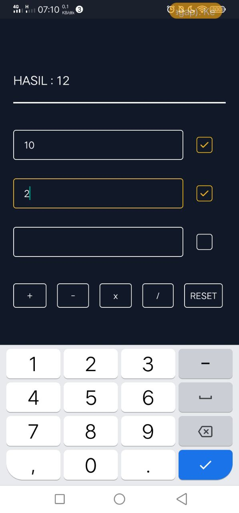

# Welcome to your new Osmi Kit App!

## The latest and greatest boilerplate for LibsCode & CloudGakkai opinions
This is the boilerplate that [LibsCode](https://libscode.com/) and [CloudGakkai](https://cloudgakkai.dev/) uses as a way to test bleeding-edge changes to our React Native stack.

## Tech Stack
Osmi Kit apps include the following rock-solid technical decisions out of the box:
- React Native
- React Navigation 5
- OsmiCSX
- AsyncStorage
- apisauce
- Flipper-ready
- Reactotron-ready
- TDD-ready

## Quick Start
The Ignite boilerplate project's structure will look similar to this:
```
osmi-app
├── App
│   ├── Components
│   ├── Config
│   ├── Containers
│   ├── Fixtures
│   ├── Images
│   ├── Lib
│   ├── Navigation
│   ├── Redux
│   ├── Sagas
│   ├── Services
│   ├── Themes
├── Tests
│   ├── Components
│   ├── Services
│   ├── Setup.js
├── android
│   ├── app
│   ├── build.gradle
│   ├── gradle
│   ├── gradle.properties
│   ├── gradlew
│   ├── gradlew.bat
│   ├── keystores
│   └── settings.gradle
├── ios
│   ├── OsmiApp
│   ├── OsmiApp-tvOS
│   ├── OsmiApp-tvOSTests
│   ├── OsmiApp.xcodeproj
│   └── OsmiAppTests
├── index.js
├── .babelrc
├── .eslintrc.js
├── .env.example
├── .gitignore
├── app.json
├── babel.config.js
├── metro.config.js
├── package.json
└── README.md
```

### ./App directory
Included in an Osmi Kit boilerplate project is the app directory. This is a directory you would normally have to create when using vanilla React Native.

The inside of the src directory looks similar to the following:
```
App
├── Components
├── Config
├── Containers
├── Fixtures
├── Images
├── Lib
├── Navigation
├── Redux
├── Sagas
├── Services
└── Themes
```

**Components** This is where your React components will live. Each component will have a directory containing the `.js` file, along with a style file inside `Styles` folder. The app will come with some commonly used components like Button.

**Config** This is where all of your app configuration located like Reactotron config, persist, etc.

**Containers** This is where your screen components will live. A screen is a React component which will take up the entire screen and be part of the navigation hierarchy. Each screen will have a directory containing the `.js` file, along with style file inside `Styles` folder.

**Fixtures** This is where your dummy api will be located. All data stored inside `.json` file.

**Images** This is where all of your local image assets will live. Store all local image asset file and register each image inside `index.js` file.

**Lib** This is where your custom library will live. You can put utility tools, string converter, or any custom helper here.

**Navigation** This is where your navigation will live. All of your live screens will be registered.

**Redux** This is where your Redux will live.

**Sagas** This is where your Sagas will live.

**Services** This is where your app services will live.

**Themes** This is where your app themes will live.

### ./Tests directory
This directory will hold your Jest configs and mocks, as well as your storyshots test file. This is a file that contains the `snapshots` of all your component.

## Running your App
### Prerequisites:
- Make sure you already setup React Native environtment (Android SDK, Java, etc.)

### How to Setup
**Step 1:** git clone this repo

**Step 2:** cd to the cloned repo

**Step 3:** Install the Application with `yarn install` or `npm install`

**Step 4:** Run `npx pod-install` for iOS only

### Run the CLI:
1. cd to the cloned repo
2. Run Build for either OS
* for iOS
    * run `npx react-native run-ios`
* for Android
  * run `npx react-native run-android`

## :closed_lock_with_key: Secrets

This project uses [react-native-config](https://github.com/luggit/react-native-config) to expose config variables to your javascript code in React Native. You can store API keys
and other sensitive information in a `.env` file:

```
API_URL=https://myapi.com
GOOGLE_MAPS_API_KEY=abcdefgh
```

and access them from React Native like so:

```
import Secrets from 'react-native-config'

Secrets.API_URL  // 'https://myapi.com'
Secrets.GOOGLE_MAPS_API_KEY  // 'abcdefgh'
```

The `.env` file is ignored by git keeping those secrets out of your repo.

### Get started:
1. Copy .env.example to .env
2. Add your config variables
3. Follow instructions at [https://github.com/luggit/react-native-config#setup](https://github.com/luggit/react-native-config#setup)
4. Done!


